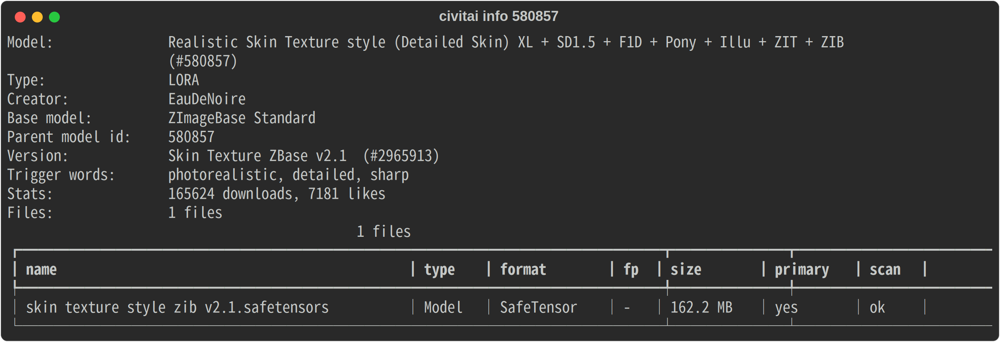
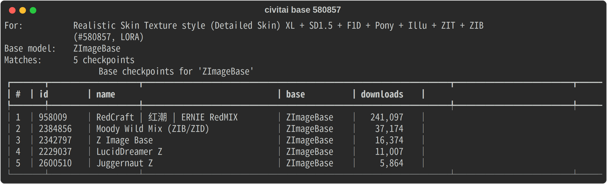

<!-- Badges: update the `mr8bit/civit-ai-cli` slug below to your actual GitHub owner/repo. -->
# civitai-hub

[](https://github.com/mr8bit/civit-ai-cli/actions/workflows/ci.yml)
[](https://www.python.org/downloads/)
[](https://github.com/astral-sh/ruff)

**`huggingface_hub`, but for [CivitAI](https://civitai.com).** Point it at a model URL to inspect what's inside (type, base/parent model, every file with sizes and hashes) and download the checkpoint or LoRA into a deduplicated, content-addressed cache — usable as both a CLI and an importable Python library.

```console
$ civitai download https://civitai.com/models/580857 --fp16 -o ~/ComfyUI/models/loras
~/ComfyUI/models/loras/realistic-skin-xl.safetensors
```

<p align="center">
  
  <br><em><code>civitai info &lt;url&gt;</code> — what's inside a model at a glance</em>
</p>

**Contents:** [Features](#features) · [Install](#install) · [CLI](#cli-quickstart) · [Library](#library-usage) · [Auth](#authentication) · [Configuration](#configuration) · [How it works](#how-it-works) · [Docker](#docker) · [Development](#development)

## Features

- **Inspect before you fetch** — `civitai info <url>` shows the model type, base/parent model, the selected version, and a table of every file in it (size, format, precision, hash, scan status).
- **Smart, scriptable downloads** — picks the URL-pinned version (or the latest) and its primary file by default; override with `--version-id`, `--fp16/--fp32`, `--pruned/--full`, `--format`, `--file`, or grab everything with `--all`.
- **Find the base model** — `civitai base <lora-url>` lists the checkpoints a LoRA's base-model family runs on (CivitAI only exposes the family name, not a direct link), with `--download N` to grab one.
- **Managed cache like HF Hub** — content-addressed blobs keyed by SHA256, with per-version snapshot symlinks. The same file reused across versions is stored once. Re-downloads are skipped.
- **Resumable & verified** — HTTP range-resume for interrupted downloads, automatic SHA256 verification, and a live progress bar.
- **Library + CLI** — everything the CLI does is a one-line call from Python.
- **Safe by default** — blocks files flagged unsafe by CivitAI's scanners (override with `--allow-unscanned`) and fails fast on early-access/gated content with a clear message.

## Install

**From PyPI** (recommended):

```bash
pipx install civitai-hub        # isolated CLI
pip install civitai-hub         # into the current environment
```

**With Docker** — no install needed:

```bash
docker run --rm ghcr.io/mr8bit/civit-ai-cli info 580857
```

**From a GitHub release** (without PyPI) — pin a tag from the [releases page](https://github.com/mr8bit/civit-ai-cli/releases):

```bash
pipx install "git+https://github.com/mr8bit/civit-ai-cli@v0.2.1"
```

For development from a clone:

```bash
python -m venv .venv && source .venv/bin/activate
pip install -e ".[dev]"
```

## CLI quickstart

```bash
# Inspect a model (human table, or --json for machines)
civitai info https://civitai.com/models/580857/realistic-skin
civitai info 580857 --json

# Download the primary file of the latest (or URL-pinned) version
civitai download https://civitai.com/models/580857

# Drop a specific precision straight into your ComfyUI/A1111 folder
civitai download 580857 --fp16 -o ~/ComfyUI/models/loras

# Preview what would be fetched without downloading
civitai download 580857 --dry-run

# Grab every file in the version
civitai download 580857 --all

# Find the base checkpoints a LoRA runs on, then grab one
civitai base 580857
civitai base 580857 --download 1 -o ~/ComfyUI/models/checkpoints
```

<p align="center">
  
  <br><em><code>civitai base &lt;url&gt;</code> — the checkpoints a LoRA runs on, most-downloaded first</em>
</p>

The downloaded path is printed to **stdout** (the progress bar goes to stderr), so it pipes cleanly:

```bash
MODEL=$(civitai download 580857 --no-progress)
```

## Library usage

```python
import civitai_hub

# Inspect
info = civitai_hub.model_info("https://civitai.com/models/580857")
print(info.model.type, info.version.base_model, len(info.files))

# Download — returns the local Path (or list[Path] with all=True)
path = civitai_hub.download(
    "https://civitai.com/models/580857",
    fp="fp16",
    local_dir="~/ComfyUI/models/loras",
)
```

`download(...)` mirrors `hf_hub_download` (single file) and `snapshot_download` (`all=True`).

## Authentication

Most public files download without a token. For gated, NSFW, or early-access resources, create an API key in your [CivitAI account settings](https://civitai.com/user/account) and provide it via:

```bash
export CIVITAI_TOKEN=<your key>     # or pass --token <key>
```

## Configuration

Precedence is **flag → environment variable → default**.

| Setting | Flag | Env var | Default |
|---|---|---|---|
| API token | `--token` (download/base) | `CIVITAI_TOKEN` | _(anonymous)_ |
| Cache root | `--cache-dir` (download/base) | `CIVITAI_HOME` | platform cache dir (`~/.cache/civitai` on Linux) |
| Offline (cache only) | — | `CIVITAI_OFFLINE` | off |
| Copy instead of symlink | `--no-symlinks` (download) | `CIVITAI_DISABLE_SYMLINKS` | symlinks on |
| Disable progress bar | `--no-progress` (download/base) | `CIVITAI_NO_PROGRESS` | progress on |

The flags live on `download`/`base`; `civitai info` takes only `--version-id`/`--json` and reads the env vars for everything else.

## How it works

A model URL resolves to one `GET /api/v1/models/{id}` call; the version is the URL's pinned `modelVersionId` (or the latest published one), and the file is that version's primary `.safetensors` unless you filter it. Downloads go only to `civitai.com` (the host is checked first) and authenticate with the `Authorization` header — httpx strips it on the cross-host CDN redirect, so the token never leaves civitai.com or lands in a URL. The download is SHA256-verified and lands in the cache:

```
$CIVITAI_HOME/
└── models/<modelId>/
    ├── blobs/<sha256>                      # content-addressed, deduplicated
    └── snapshots/<versionId>/<filename>    # symlink → ../../blobs/<sha256>
```

`--local-dir` then materializes a symlink (or copy) of the blob into the folder you choose.

For the full command/flag reference, cache details, troubleshooting, and exit codes, see **[docs/usage.md](docs/usage.md)**.

## Docker

Prebuilt multi-arch images are published to the GitHub Container Registry on every release:

```bash
# inspect a model
docker run --rm ghcr.io/mr8bit/civit-ai-cli info 580857

# download into a host folder (mount it as the cache + output)
docker run --rm -v "$PWD/models:/data" \
  ghcr.io/mr8bit/civit-ai-cli download 580857 -o /data

# pass a token for gated content
docker run --rm -e CIVITAI_TOKEN="$CIVITAI_TOKEN" \
  ghcr.io/mr8bit/civit-ai-cli base 580857
```

The cache lives at `/data` inside the image (`CIVITAI_HOME`) — mount a volume there to persist downloads. Build it yourself with `docker build -t civitai-hub .`.

## Development

```bash
pip install -e ".[dev]"
pytest                 # full suite (offline; httpx mocked with respx)
pytest tests/test_resolver.py::test_fp_selector -v   # a single test
ruff check src tests   # lint
CIVITAI_LIVE=1 pytest tests/test_live.py -v           # opt-in test against the real API
```

See **[CONTRIBUTING.md](CONTRIBUTING.md)** for the architecture overview and conventions, and `docs/superpowers/specs/` + `docs/superpowers/plans/` for the original design and implementation plan.

## License

[MIT](LICENSE) © Artemiy Mazaew
